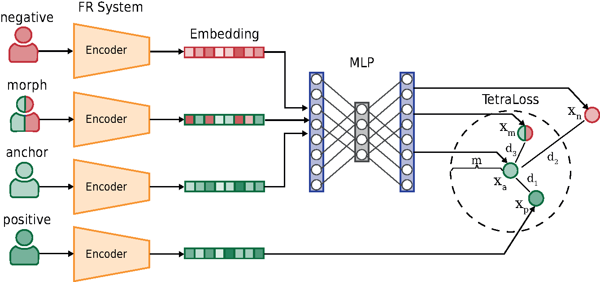

# TetraLoss: Improving the Robustness of Face Recognition against Morphing Attacks
**[Published in the proceedings of the 2024 IEEE 18th International Conference on Automatic Face and Gesture Recognition (FG)](https://ieeexplore.ieee.org/document/10581988)**

## Introduction
This repository contains code for the above-mentioned paper. Specifically, we provide a script for using a pre-trained TetraLoss model and MAD model to obtain comparison/detection scores from the corresponding models. 

<p align="center">
  
</p>

---

## Installation
To use this repository, ensure you have the following installed:

- PyTorch
- Numpy
- scikit-learn

The repository was tested using **Python 3.8.16** and specific versions outlined in the `requirements.txt` file.

The implementation was tested on Linux using **NVIDIA A100 Tensor Core GPUs**.

---

## Testing
This repository includes a pre-trained TetraLoss model and a Morphing Attack Detection (MAD) model for evaluation on bona fide and morphed images. It is based on AdaFace ResNet100.

### Pre-trained Models
TetraLoss model and MAD model:

Link: https://cloud.h-da.de/s/NBW3XGWN69CkZqC
Password: mmREmj6g4DjqRA

### Prerequisite
Before running the model, extract face embeddings using the **adaface_ir101_ms1mv2.ckpt** file from the [AdaFace](https://github.com/mk-minchul/AdaFace) repository. Ensure you use the specific version of AdaFace based on **ResNet100 (ir_101)**, trained on **MS1MV2**. Follow the general inference guidelines from the AdaFace repository to extract and save embeddings from your dataset. The code expects that the embeddings are numpy arrays saved using `np.savetxt` and are loaded as numpy arrays in the code (see `utils/helper.py`).

### Using the Model
To test the model, a script, `test.py`, is provided. It takes as input a reference (suspected) and a probe image and produces the following:

1. TetraLoss comparison score
2. MAD score
3. Combined score from the TetraLoss FR model and the MAD system

The resulting scores are written to the standard output.

The script can be run as follows:

```bash
python test.py --checkpoint_tetra <path_to_tetra_checkpoint> \
               --checkpoint_mad <path_to_mad_checkpoint> \
               --path_original_reference_emb <reference_embedding_file_path> \
               --path_original_probe_emb <probe_embedding_file_path>
```

For more information about the parameters of the test script, see `python test.py --help`

If the same images are used in multiple comparisons, it is recommended to first extract the embeddings and save them (e.g., to disk) and then calculate the similarity scores.

Information to obtain the checkpoints are provided in the [Pre-trained models](#pre-trained-models) section.

---

## (A) Acknowledgments

Part of the code in this repository is adapted from the [Self-restrained Triplet Loss](https://github.com/fdbtrs/Self-restrained-Triplet-Loss) repository.
The used MAD algorithm is based on the approach described in the paper [Deep Face Representations for Differential Morphing Attack Detection](https://ieeexplore.ieee.org/document/9093905).

---

## (B) Citation

If you find this useful for your research, please consider citing our paper: 

**TetraLoss: Improving the Robustness of Face Recognition against Morphing Attacks**:

```
@inproceedings{Ibsen-TetraLoss-FG-2024,
 Author = {M. Ibsen and L. J. Gonzalez-Soler and C. Rathgeb and C. Busch},
 Booktitle = {{IEEE} Intl. Conf. on Automatic Face and Gesture Recognition ({FG})},
 Title = {TetraLoss: Improving the Robustness of Face Recognition against Morphing Attacks},
 Year = {2024}
}
```

Additionally, consider citing the following works:

**Self-restrained triplet loss for accurate masked face recognition**:

```
@article{Fadi-SelfRestrainedTLForMaskedFR-PatternRecognition-2022,
title = {Self-restrained triplet loss for accurate masked face recognition},
journal = {Pattern Recognition},
year = {2022},
author = {F. Boutros and N. Damer and F. Kirchbuchner and A. Kuijper},
volume = {124},
issn = {0031-3203}
}
```

**Deep Face Representations for Differential Morphing Attack Detection**:

```
@article{Scherhag-FaceMorphingAttacks-TIFS-2020,
 Author = {U. Scherhag and C. Rathgeb and J. Merkle and Christoph Busch},
 Journal = {{IEEE} Trans. on Information Forensics and Security},
 Title = {Deep Face Representations for Differential Morphing Attack Detection},
 Year = {2020},
 volume={15}
}
```
